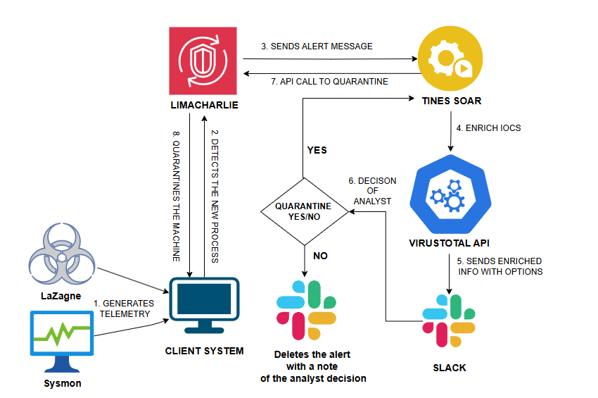
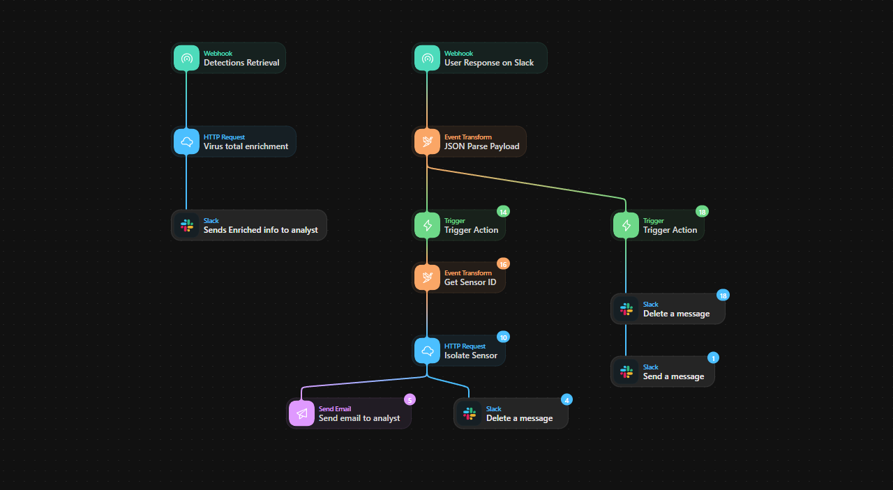
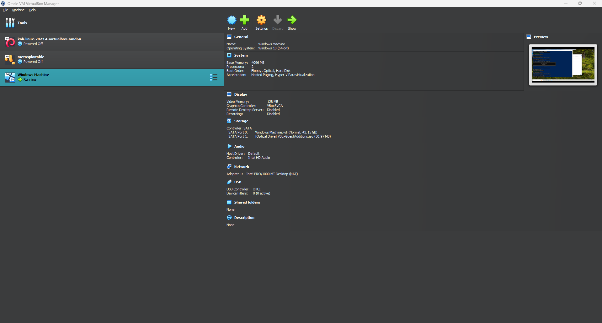
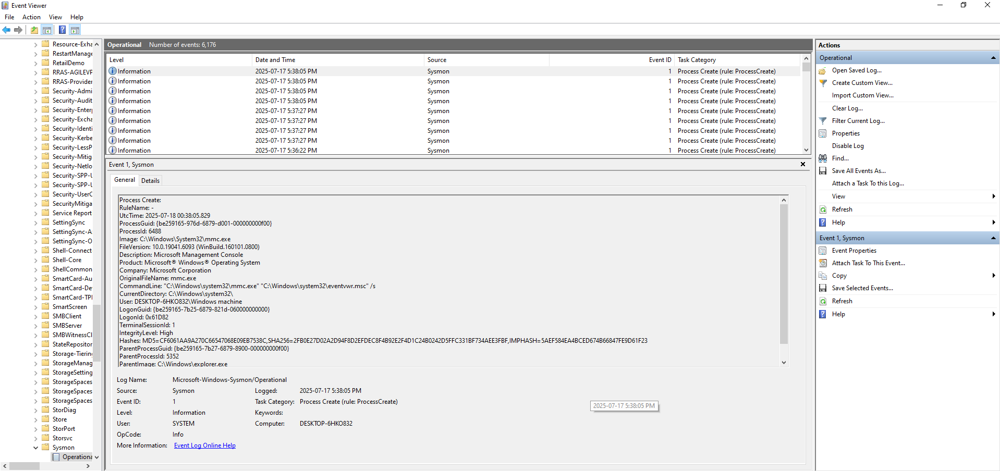
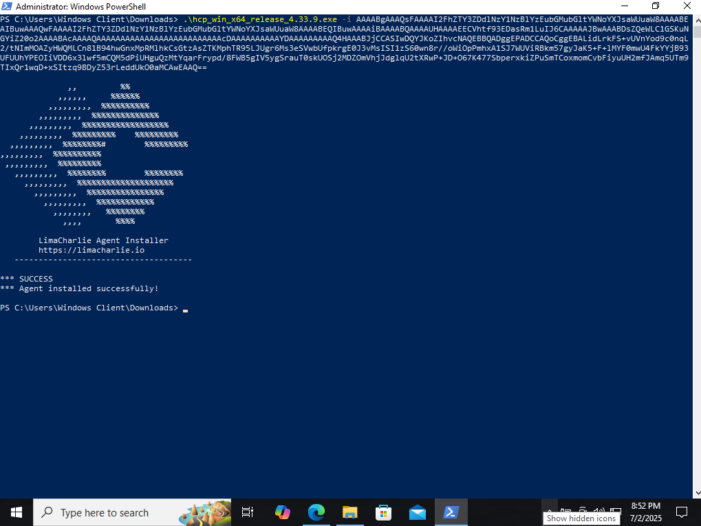

# LaZagne Detection and Response Workflow

This project implements an automated Security Orchestration, Automation, and Response (SOAR) workflow for detecting and responding to LaZagne executions in an Endpoint Detection and Response (EDR) environment. LaZagne is a credential-dumping tool often used in attacks, so we detect it via LimaCharlie (EDR), enrich with VirusTotal, notify via Slack with interactive buttons (Quarantine/Ignore), and automate responses in Tines (SOAR tool).

The workflow ensures only one detection per execution (via suppression), handles duplicates, quarantines machines on approval, deletes alerts on ignore, and sends confirmations.

## Table of Contents
- [Overview](#overview)
- [Architecture](#architecture)
- [Prerequisites](#prerequisites)
- [Test Environment Setup (VM Installation)](#test-environment-setup-vm-installation)
- [Setup Guide](#setup-guide)
  - [LimaCharlie Configuration](#limacharlie-configuration)
  - [Tines Workflow](#tines-workflow)
  - [Slack App Integration](#slack-app-integration)
  - [VirusTotal Integration](#virustotal-integration)
- [Testing and Troubleshooting](#testing-and-troubleshooting)
- [Extensions and Improvements](#extensions-and-improvements)
- [License](#license)

## Overview
The system detects LaZagne runs on Windows endpoints, sends alerts to Slack for analyst review, and automates quarantine (network isolation) or ignore actions. Key features:
- Deduplication to avoid multiple alerts per execution.
- Enrichment with VirusTotal for threat intel.
- Interactive Slack buttons for quick response.
- Email/Slack confirmations post-action.
- Secure API handling with credentials.

**Why this project?** It demonstrates EDR-SOAR integration for faster incident response, reducing manual work.


*High-level workflow diagram showing components and steps.*

## Architecture
The workflow:
1. LimaCharlie detects LaZagne via D&R rule (NEW_PROCESS/EXISTING_PROCESS events).
2. Webhook sends detection to Tines.
3. Tines enriches with VirusTotal API.
4. Tines posts interactive Slack message with details and buttons (Quarantine/Ignore).
5. On button click:
   - Quarantine: Extracts sid, fetches JWT, isolates via LimaCharlie API, deletes alert, sends confirmation.
   - Ignore: Deletes alert, sends "Marked as false positive" message.
6. Suppress duplicates in LimaCharlie rule.


*Screenshot of the full Tines storyboard canvas with agents connected.*

## Prerequisites
- **LimaCharlie Account**: With API key (user-scoped with "sensor:isolate" permission) and UID/OID.
- **Tines Account**: Free tier works; create credentials for APIs.
- **Slack Workspace**: App with bot token (scopes: chat:write, chat:delete, incoming-webhooks).
- **VirusTotal API Key**: Free account for enrichment.
- Test endpoint (Windows VM) with LaZagne.exe for testing.

## Test Environment Setup (VM Installation)
To safely test the workflow, set up a virtual machine (VM) as your test endpoint. This isolates LaZagne executions and prevents risks to real systems. We recommend using [VirtualBox](https://www.virtualbox.org/) (free) for Windows guests.

### Download and Install VirtualBox
- Go to [virtualbox.org](https://www.virtualbox.org/) and download the latest version for your host OS.
- Install it (follow the wizard; enable Extension Pack for better USB/network support).

### Download Windows ISO
- Get a Windows 10/11 ISO from [Microsoft's site](https://www.microsoft.com/en-us/software-download/windows10) (use a free trial or your license).

### Create the VM
- Open VirtualBox > Click "New".
- Name: "Test-Windows-Endpoint".
- Type: Microsoft Windows, Version: Windows 10/11 (64-bit).
- Allocate RAM: 4GB+, CPU: 2+, Storage: 50GB+ dynamic VDI.
- Attach the ISO: Settings > Storage > Add optical drive > Select ISO.

### Install Windows
- Start the VM > Follow Windows setup (create user, skip product key for test).

### Install Sysmon (For Enhanced Logging)
- Download Sysmon from [Microsoft Sysinternals](https://learn.microsoft.com/en-us/sysinternals/downloads/sysmon).
- Extract the ZIP on the VM.
- Run in Command Prompt (as admin): `Sysmon64.exe -accepteula -i sysmonconfig.xml` (use a config file like from SwiftOnSecurity's GitHub for good defaults: Download [sysmonconfig.xml](https://github.com/SwiftOnSecurity/sysmon-config) and place it in the same folder).
- Verify: Open Event Viewer > Applications and Services Logs > Microsoft > Windows > Sysmon > Operational—look for sysmon with event_id 1.

### LimaCharlie Account Creation and Installation Key

To get started with LimaCharlie, you'll need to create a free account and generate an installation key for deploying the sensor on your test endpoint. This key is used to enroll devices (like your VM) into your organization for monitoring.

#### Step 1: Create a LimaCharlie Account
- Visit the [LimaCharlie signup page](https://app.limacharlie.io/signup) or [limacharlie.io](https://limacharlie.io) and click "Sign Up" or "Try for Free".
- Fill in your details: Email, password, and organization name (e.g., "TestOrg").
- Verify your email (check inbox for confirmation link).
- Log in at [app.limacharlie.io](https://app.limacharlie.io) with your credentials.
- Note: Free tier includes basic features enough for this entire project.

#### Step 2: Generate an Installation Key
- In the dashboard, go to the left menu > Sensors > Installation Keys (or search for "Installation Keys").
- Click "Create New Key".
- Name it: e.g., "TestVMKey".
- Set permissions: Default is fine for testing (includes telemetry and response capabilities).
- Expiration: Set to "Never" for persistent use, or a date for temporary.
- Click "Create"—copy the key (long string like "install-key-abc123...").
- Use this key to install the sensor on your VM (run the installer command with the key).


This sets up your EDR backend—proceed to sensor installation on the VM.

### Install LimaCharlie Sensor
- Download from LimaCharlie dashboard > Run installer on VM.

### Test Setup
- Download LaZagne.exe to the VM (from [GitHub repo](https://github.com/AlessandroZ/LaZagne)—use safely!).
- Run it (e.g., `LaZagne.exe all`) to trigger detection.


*VirtualBox main window with VM created.*


*New processes are detected via Sysmon.*


*LimaCharlie sensor install prompt on VM.*

## Setup Guide

### LimaCharlie Configuration
1. Log into app.limacharlie.io > Detection & Response > Rules > Create Rule.
2. Use this YAML for detection (matches file path, command line, or hash; Windows only):
   ```yaml
   detect:
     events:
       - NEW_PROCESS
       - EXISTING_PROCESS
     op: and
     rules:
       - op: is windows
       - op: or
         rules:
           - case sensitive: false
             op: ends with
             path: event/FILE_PATH
             value: LaZagne.exe
           - case sensitive: false
             op: contains
             path: event/COMMAND_LINE
             value: Lazagne
           - case sensitive: false
             op: is
             path: event/HASH
             value: 64dd55e1c2373deed25c2776f553c632e58c45e56a0e4639dfd54ee97eab9c19
   ```
3. Response (with suppression for dedup):
   ```yaml
   respond:
     - action: report
       metadata:
         author: Josh
         description: Lazagne detected
         falsepositives:
           - Maybe
         level: high
         tags:
           - attack.credential_access
       name: Credential Stuffing alert
       suppression:
         is_global: false
         keys:
           - "{{ .event.FILE_PATH }}"  # Dedupes by file path
         investigation_name: LaZagne Detection
         max_count: 1
         period: 1m
   ```
4. Add webhook output: In response, add action to send to your Tines webhook URL.


*Screenshot of the D&R rule editor with detect and response YAML.*

### Tines Workflow
1. Create a new story in Tines.
2. Add agents as follows (connect with arrows):
   - **Webhook Trigger**: Receives from LimaCharlie.
   - **Event Transformation (JSON Parse)**: Parses payload.
   - **HTTP Request (VirusTotal Enrichment)**: API call with file hash from detection.
   - **Send Message to Slack Template**: Posts interactive alert with buttons (include sid in value as JSON).
   - **Trigger (Branching)**: Rules for "quarantine_yes" and "quarantine_no" based on action_id/value.
   - On "yes":
     - Event Transformation (Regex Extract sid).
     - Isolate Sensor Template (or custom HTTP: JWT then isolation).
     - HTTP Request (Delete original message).
     - Send Message to Slack Template (confirmation: "Quarantined by [user]").
   - On "no":
     - HTTP Request (Delete message).
     - Send Message to Slack Template (false positive message).
3. Credentials: Create for LimaCharlie (uid/secret), Slack (bot token), VirusTotal (key).

Export your Tines story as JSON and include it in this repo for replication.


*Close-up screenshot of Trigger rules in Tines.*


*Screenshot of the Event Transformation agent for sid extraction.*

### Slack App Integration
1. Create app at api.slack.com/apps > Add features: Bot, permissions (chat:write, chat:delete).
2. Install to workspace, get bot token.
3. Add interactivity: Set Request URL to your Tines webhook for button clicks.


*Screenshot of Slack app permissions page.*


*Screenshot of Slack interactivity setup with Tines webhook URL.*

### VirusTotal Integration
1. Get free API key at virustotal.com.
2. In Tines, add credential "virustotal_api" with key.
3. HTTP Request: GET `https://www.virustotal.com/api/v3/files/{hash}` with header "x-apikey: {{ .virustotal_api.key }}".

## Testing and Troubleshooting
1. Run LaZagne on test endpoint—expect one detection.
2. Check Slack for alert, click buttons, verify quarantine in LimaCharlie, confirmations.
3. Common issues:
   - Duplicates: Verify suppression keys/period.
   - API errors: Check logs for 401 (bad creds), 403 (permissions).
   - Tines fails: Replay events, inspect agent outputs.


*Screenshot of Slack alert message before action.*


*Screenshot of Slack confirmation after quarantine.*


*Screenshot of detection in LimaCharlie timeline.*


*Screenshot of Tines run logs showing successful flow.*

## Extensions and Improvements
- Add unisolate button/flow.
- Integrate email notifications via Tines template.
- Monitor with Tines dashboards.
- Scale: Add more rules for other tools.

## License
MIT License. See LICENSE file.
