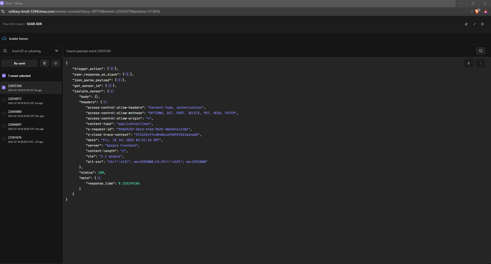
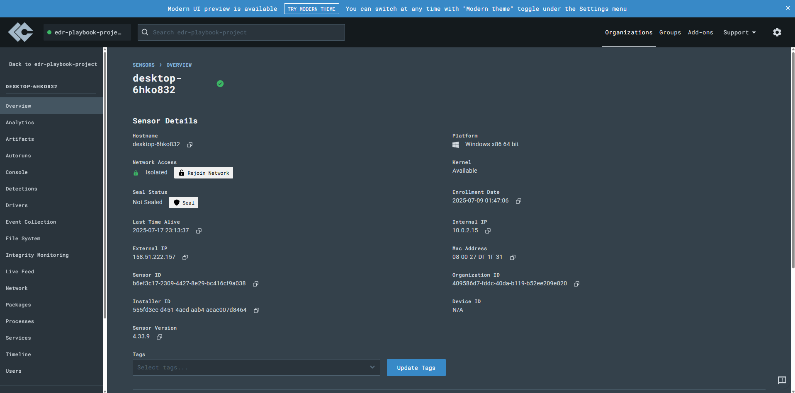
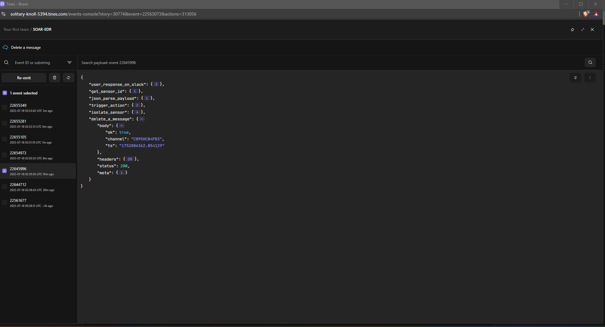
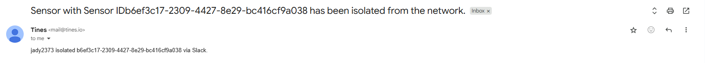
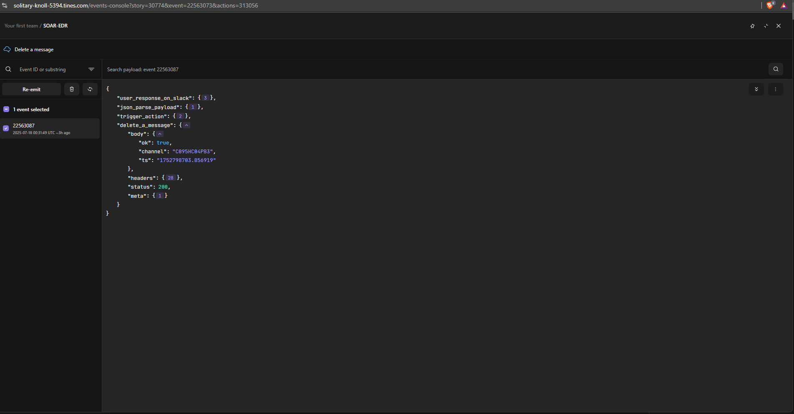
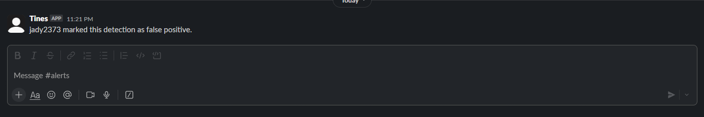
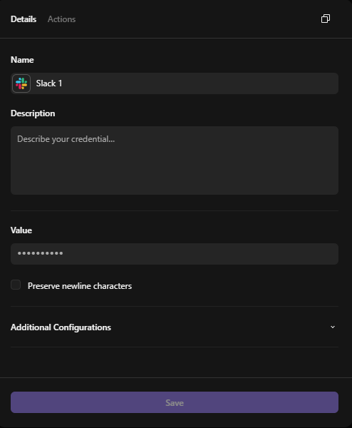
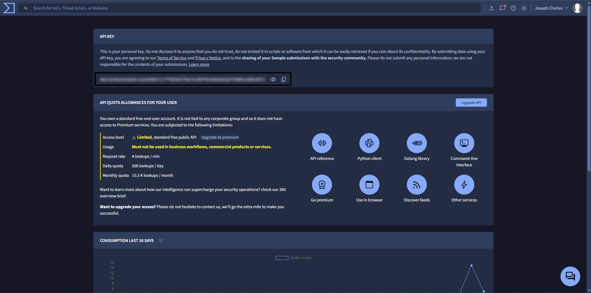
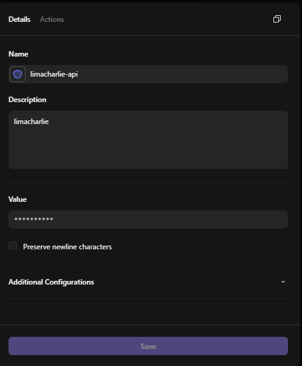

# SOAR-EDR AUTOMATION PROJECT

This project implements an automated Security Orchestration, Automation, and Response (SOAR) workflow for detecting and responding to LaZagne executions in an Endpoint Detection and Response (EDR) environment. LaZagne is a credential-dumping tool often used in attacks, so we detect it via LimaCharlie (EDR), enrich with VirusTotal, notify via Slack with interactive buttons (Quarantine/Ignore), and automate responses in Tines (SOAR tool).

The workflow ensures only one detection per execution (via suppression), handles duplicates, quarantines machines on approval, deletes alerts on ignore, and sends confirmations.

## Table of Contents
- [Inspirations and Acknowledgements](#inspirations-and-acknowledgements)
- [Overview](#overview)
- [Architecture](#architecture)
- [Prerequisites](#prerequisites)
- [Test Environment Setup (VM Installation)](#test-environment-setup-vm-installation)
- [Setup Guide](#setup-guide)
- [Testing and Troubleshooting](#testing-and-troubleshooting)
- [Extensions and Improvements](#extensions-and-improvements)
- [License](#license)
- [Conclusion](#conclusion)

## Inspirations and Acknowledgments

This project was inspired by the [MYDFIR SOAR project](https://youtu.be/Gs1pYJfWv7k?si=HPL_kqe5mb8GUF_P) , which provided a foundational idea for integrating EDR with SOAR tools. While I drew inspiration from its structure, we took different paths, including custom deduplication in LimaCharlie, interactive Slack buttons with button value encoding for sid, and VirusTotal enrichment. 

## Overview
The system detects LaZagne runs on Windows endpoints, sends alerts to Slack for analyst review, and automates quarantine (network isolation) or ignore actions. Key features:
- Deduplication to avoid multiple alerts per execution.
- Enrichment with VirusTotal for threat intel.
- Interactive Slack buttons for quick response.
- Email/Slack confirmations post-action.
- Secure API handling with credentials.

**Why this project?** It demonstrates EDR-SOAR integration for faster incident response, reducing manual work.


*High-level workflow diagram.*

## Architecture
The workflow:
1. LimaCharlie detects LaZagne via D&R rule (NEW_PROCESS/EXISTING_PROCESS events).
2. Webhook sends detection to Tines.
3. Tines enriches with VirusTotal API.
4. Tines posts interactive Slack message with details and buttons (Quarantine/Ignore).
5. On button click:
   - Quarantine: Extracts sid, isolates via LimaCharlie API, deletes alert, sends confirmation.
   - Ignore: Deletes alert, sends "Marked as false positive" message.
6. Suppress duplicates in LimaCharlie rule.


*Screenshot of the full Tines storyboard canvas with agents connected.*

## Prerequisites
- **LimaCharlie Account**: With API key (user-scoped with "sensor:isolate" permission) and UID/OID.
- **Tines Account**: Free tier works; create credentials for APIs.
- **Slack Workspace**: App with bot token (scopes: chat:write, chat:delete, incoming-webhooks).
- **VirusTotal API Key**: Free account for enrichment.
- Test endpoint (Windows VM) with LaZagne.exe for testing.

## Test Environment Setup (VM Installation)
To safely test the workflow, set up a virtual machine (VM) as your test endpoint. This isolates LaZagne executions and prevents risks to real systems. We recommend using [VirtualBox](https://www.virtualbox.org/) (free) for Windows guests.

### Download and Install VirtualBox
- Go to [virtualbox.org](https://www.virtualbox.org/) and download the latest version for your host OS.
- Install it (follow the wizard; enable Extension Pack for better USB/network support).

### Download Windows ISO
- Get a Windows 10/11 ISO from [Microsoft's site](https://www.microsoft.com/en-us/software-download/windows10) (use a free trial or your license).

### Create the VM
- Open VirtualBox > Click "New".
- Name: "Test-Windows-Endpoint".
- Type: Microsoft Windows, Version: Windows 10/11 (64-bit).
- Allocate RAM: 4GB+, CPU: 2+, Storage: 50GB+ dynamic VDI.
- Attach the ISO: Settings > Storage > Add optical drive > Select ISO.


*VirtualBox main window with VM created.*

### Install Windows
- Start the VM > Follow Windows setup (create user, skip product key for test).

### Install Sysmon (For Enhanced Logging)
- Download Sysmon from [Microsoft Sysinternals](https://learn.microsoft.com/en-us/sysinternals/downloads/sysmon).
- Extract the ZIP on the VM.
- Run in Command Prompt (as admin): `Sysmon64.exe -accepteula -i sysmonconfig.xml` (use a config file like from SwiftOnSecurity's GitHub: Download [sysmonconfig.xml](https://github.com/SwiftOnSecurity/sysmon-config) and place it in the same folder).
- Verify: Open Event Viewer > Applications and Services Logs > Microsoft > Windows > Sysmon > Operational—look for sysmon with event_id 1.


*New processes are detected via Sysmon.*

### LimaCharlie Account Creation and Installation Key

To get started with LimaCharlie, you'll need to create a free account and generate an installation key for deploying the sensor on your test endpoint. This key is used to enroll devices (like your VM) into your organization for monitoring.

#### Step 1: Create a LimaCharlie Account
- Visit the [LimaCharlie signup page](https://app.limacharlie.io/signup) or [limacharlie.io](https://limacharlie.io) and click "Sign Up" or "Try for Free".
- Fill in your details: Email, password, and organization name (e.g., "TestOrg").
- Verify your email (check inbox for confirmation link).
- Log in at [app.limacharlie.io](https://app.limacharlie.io) with your credentials.
- Note: Free tier includes basic features enough for this entire project.

#### Step 2: Generate an Installation Key
- In the dashboard, go to the left menu > Sensors > Installation Keys (or search for "Installation Keys").
- Click "Create New Key".
- Name it: e.g., "TestVMKey".
- Set permissions: Default is fine for testing (includes telemetry and response capabilities).
- Expiration: Set to "Never" for persistent use, or a date for temporary.
- Click "Create"—copy the key (long string like "install-key-abc123...").
- Use this key to install the sensor on your VM (run the installer command with the key).


This sets up your EDR backend—proceed to sensor installation on the VM.

### Install LimaCharlie Sensor
- Download from LimaCharlie dashboard > Run installer on VM.


*LimaCharlie sensor install prompt on VM.*

### Test Setup
- Download LaZagne.exe to the VM (from [GitHub repo](https://github.com/AlessandroZ/LaZagne)—use safely!).
- Run it (e.g., `LaZagne.exe all`) to trigger detection.


*Lazagne is successfully running.*

### LimaCharlie Configuration
1. Log into app.limacharlie.io > Detection & Response > Rules > Create Rule.
2. Use this YAML for detection (matches file path, command line, or hash; Windows only):
   ```yaml
   detect:
     events:
       - NEW_PROCESS
       - EXISTING_PROCESS
     op: and
     rules:
       - op: is windows
       - op: or
         rules:
           - case sensitive: false
             op: ends with
             path: event/FILE_PATH
             value: LaZagne.exe
           - case sensitive: false
             op: contains
             path: event/COMMAND_LINE
             value: Lazagne
           - case sensitive: false
             op: is
             path: event/HASH
             value: 64dd55e1c2373deed25c2776f553c632e58c45e56a0e4639dfd54ee97eab9c19
   ```
3. Response (with suppression for dedup):
   ```yaml
   respond:
     - action: report
       metadata:
         author: Josh
         description: Lazagne detected
         falsepositives:
           - Maybe
         level: high
         tags:
           - attack.credential_access
       name: Credential Stuffing alert
       suppression:
         is_global: false
         keys:
           - "{{ .event.FILE_PATH }}"  # Dedupes by file path
         investigation_name: LaZagne Detection
         max_count: 1
         period: 1m
   ```
   
### Tines Workflow
1. Create a new story in Tines.
2. Add agents as follows (connect with arrows):
   
#### Detections Retrieval Webhook (from LimaCharlie)
- Add a Webhook Trigger agent as the entry point for detections from LimaCharlie.
- Configure: Generate the webhook URL in Tines (copy it) and set it as the output in your LimaCharlie D&R rule's response.
- This receives the raw detection payload when LaZagne is detected.


*Output Configuration.*

#### HTTP Request (VirusTotal Enrichment)
- Add an HTTP Request agent connected from the JSON Parse agent.
- This queries VirusTotal for threat intel on the detected file's hash (e.g., malicious flags, reputation).
- Method: GET.
- URL: `https://www.virustotal.com/api/v3/files/<<detections_retrieval.body.detect.event.HASH>>` (use the hash from the detection event).
- Headers: Add "x-apikey" = `{{ .virustotal_api.key }}` (your VirusTotal credential) See [VirusTotal Integration](#virustotal-integration).
- The response enriches the alert with details like detections count and link, passed to the Slack message.


#### Result


*Screenshot of the event generated from the virustotal node.*

### Slack App Integration (Custom Tines Bot Creation)
To integrate Slack with Tines, create a custom Slack app with a bot user. This enables posting messages, handling interactive buttons, and deleting alerts. Follow these steps to set it up.

1. **Create the Slack App**:
   - Go to [api.slack.com/apps](https://api.slack.com/apps) and click "Create New App".
   - Choose "From scratch", enter an app name (e.g., "Tines Alert Bot"), and select your workspace.
   - Click "Create App".

2. **Add Bot Features and Permissions**:
   - In the app dashboard, go to "OAuth & Permissions" (left menu).
   - Under "Scopes" > "Bot Token Scopes", add:
     - `chat:write` (for posting/updating messages).
     - `channels:read` (for reading messages).
     - `chat:write.public` (optional but can even send messages to public channels without the need of adding the bot)
     - `groups:read` (to access groups).
     - `commands` (for interactive actions).
     - `user:read` (for handling user interacting with the message)
   - Scroll up to "OAuth Tokens for Your Workspace" > Click "Install to Workspace" > Authorize the app.
   - Copy the "Bot User OAuth Token" (starts with "xoxb-")—this is your bot token.

3. **Add the Bot to Channels**:
   - In your Slack workspace, invite the bot to channels like "#alerts" (/invite @botname).

This bot handles alerts, buttons, and actions securely.


*Screenshot of OAuth & Permissions page with bot scopes added.*

#### Send Message to Slack Template (Interactive Alert to Analyst)
- Add the Send Message to Slack template connected from VirusTotal Enrichment.
- This sends the enriched detection (LimaCharlie details + VirusTotal intel like malicious flags, reputation, report link) to the analyst in Slack as an interactive message with Quarantine/Ignore buttons.
- Credential: Your Slack bot token (See [Slack App Integration](#slack-app-integration)).
- Channel: Channel ID of the channel you want the alert to be sent.
- Message Text: Fallback plain text with key details (e.g., "Detection Alert: LaZagne on [hostname]. VT: [malicious count]/total engines.").
- Blocks: Use JSON for formatted message:
  ```
  {
  "blocks": [
    {
      "type": "section",
      "text": {
        "type": "mrkdwn",
        "text": "*Detection Alert: LaZagne Detected*\n*Sensor ID:* <<detections_retrieval.body.routing.sid>>\n*Computer Name:* <<detections_retrieval.body.detect.routing.hostname>> \n*Type:* <<detections_retrieval.body.routing.event_type>>\n*File path:* <<detections_retrieval.body.detect.event.FILE_PATH>>"
      }
    },
    {
      "type": "section",
      "text": {
        "type": "mrkdwn",
        "text": "*Virus Total Enrichment:*\n*Times Submitted:* <<virus_total_enrichment.body.data.attributes.times_submitted>>\n*Number of Malicious Flags:* <<virus_total_enrichment.body.data.attributes.last_analysis_stats.malicious>>\n*Threat Label:* <<virus_total_enrichment.body.data.attributes.popular_threat_classification.suggested_threat_label>>\n*Link to Virus total Report:* \"https://www.virustotal.com/gui/file/<<virus_total_enrichment.body.data.id>>\"\n"
      }
    },
    {
      "type": "actions",
      "elements": [
        {
          "type": "button",
          "text": {
            "type": "plain_text",
            "text": "Quarantine?"
          },
          "style": "danger",
          "value": "{ 'action': 'quarantine', 'sid': <<detections_retrieval.body.routing.sid>> }",
          "action_id": "quarantine_yes"
        },
        {
          "type": "button",
          "text": {
            "type": "plain_text",
            "text": "🚫 Ignore"
          },
          "style": "primary",
          "value": "false_positive",
          "action_id": "quarantine_no"
        }
      ]
    }
  ]

  }
  ```
- This creates the alert with enrichment and buttons (sid passed in value for handling).


*Screenshot of the alert in slack.*

#### Webhook Trigger (for Slack User Responses)
- Add a second Webhook Trigger agent (separate from the LimaCharlie one) to receive button clicks from Slack's interactivity.
- Configure: Generate the webhook URL in Tines and set it as the "Request URL" in your Slack app's interactivity settings (api.slack.com/apps > Your App > Interactivity & Shortcuts).
- This captures the payload from Quarantine/Ignore buttons, including action_id, value (with sid), channel, and message_ts for branching and responses.


*Screenshot of the request URL set in Slack to send the user response to Tines.*


*Screenshot of the event emitted when the user responds to the message.*

#### Event Transformation (JSON Parse of Payload)
- Add an Event Transformation agent connected from the Webhook Trigger (for LimaCharlie detections) or Slack responses webhook.
- This is done as the payload from the event is just a string which makes it difficult to navigate.
- Mode: JSON Parse.
- Input Path: `<<user_response_on_slack.body.payload>>` (this parses the incoming string payload into a structured JSON object for easy access to fields like event details, actions, or sid).
- This step makes the raw data usable for enrichment, branching, and extraction (e.g., pulling HASH for VirusTotal or action_id for buttons).


*Screenshot of the Event Transformation (JSON Parse of Payload) configuration in Tines.*

#### Trigger (Branching on Button Click)
- Add a 2 Trigger agents connected from the JSON Parse (Slack payload).
- This branches the flow based on the button clicked by the analyst.
- Rules:
  - Rule 1: Path `{{ .json_parse_payload.output.actions[0].action_id }}` equals "quarantine_yes" → Connect to quarantine path (sid extraction, isolation, delete, confirmation).
  - Rule 2: Equals "quarantine_no" → Connect to ignore path (delete, false positive message).


*Event generated when user clicks quarantine.*


*Event generated when user clicks Ignore.*

#### Event Transformation (Get Sensor ID) - If User Clicks Quarantine
- On the "quarantine_yes" path from the Trigger (branching), add an Event Transformation agent connected from the Trigger output.
- Mode: Regex Extract (to pull the sid from the button's value field in the parsed Slack payload).
- Input Path: `{{ .json_parse_payload.output.actions[0].value }}` (targets the value string like "{ 'action': 'quarantine', 'sid': b6ef3c17-2309-4427-8e29-bc416cf9a038 }").
- Regex Pattern: `'sid':\s*([a-f0-9-]+)` (captures the UUID after 'sid': ).
- Output Mode: Extract First Match.
- Emit As: "sid" (reference downstream as `{{ .get_sensor_id.sid[0] }}`).
- This step extracts the sensor ID only on quarantine clicks, for use in isolation.


*Event Transformation (Get Sensor ID) output event in Tines.*

#### Isolate Sensor (via Default LimaCharlie Template) - Quarantine Path
- On the "quarantine_yes" path, add the Isolate Sensor template from Tines' LimaCharlie integration (search library or import if needed) connected from the sid extraction.
- This template automatically fetches the JWT and sends the isolation request to LimaCharlie API.
- Configure:
  - Sensor ID: `{{ .get_sensor_id.sid[0] }}` (your extracted sid reference).
  - Credential: Your LimaCharlie credential (uid/secret). See [Limacharlie Integration](#limacharlie-integration)
  - Leave other fields default (empty body for POST to `/v1/sensors/{sid}/isolation`).
- This quarantines the machine by blocking network access (persistent until unisolated).


*Screenshot of Isolate Sensor event in tines.*


*Screenshot of Isolated Sensor event in Limacharlie.*

#### HTTP Request (Delete Original Message) - After Quarantine
- On the "quarantine_yes" path, add an HTTP Request agent connected from the Isolate Sensor template (after successful isolation).
- This deletes the original Slack alert message to clean up the channel.
- Method: POST.
- URL: `https://slack.com/api/chat.delete`.
- Headers: "Authorization" = `Bearer {{ .slack_bot_token }}`.
- Body (JSON): `{ "channel": "{{ .json_parse_payload.output.channel.id }}", "ts": "{{ .json_parse_payload.output.message.ts }}" }`.
- This removes the interactive alert post-quarantine.


*Screenshot of the event after (Delete Original Message) is executed.*

#### Send Email to Analyst (Quarantine Confirmation)
- On the "quarantine_yes" path, add the Send Email template (or HTTP Request for SMTP) connected from the delete message agent.
- This emails the analyst with details: the user who approved quarantine, sensor ID, and success status.
- Configure:
  - To: Analyst email (hardcode or dynamic, e.g., `{{ .json_parse_payload.output.user.email }}` if available).
  - Subject: "Sensor with Sensor ID<<get_sensor_id.output>> has been isolated from the network.".
  - Body: HTML or plain text like "<<json_parse_payload.output.user.username>> isolated <<get_sensor_id.output>> via Slack."
  - Credential: Use default gmail.
- This notifies via email in addition to Slack.


*Screenshot of the Email sent to the analyst.*

#### HTTP Request (Delete Message) - Ignore Path (quarantine_no)
- On the "quarantine_no" path, use the default (delete-message) template of slack connected from the quarantine_no Trigger (branching).
- This deletes the original Slack alert message when the analyst chooses to ignore.
- Method: POST.
- Body (JSON): `{ "channel": "{{ .json_parse_payload.output.channel.id }}", "ts": "{{ .json_parse_payload.output.message.ts }}" }`.
- This cleans up the alert on ignore.


*Screenshot of the Delete Message output event in Tines.*

#### Send Message to Slack Template (False Positive Message) - Ignore Path
- On the "quarantine_no" path, add the Send Message to Slack template connected from the delete message agent.
- This sends a confirmation message indicating the user marked the detection as false positive.
- Credential: Your Slack bot token.
- Channel: `{{ .json_parse_payload.output.channel.id }}`.
- Message Text: <<json_parse_payload.output.user.username>> marked this detection as false positive.
- This notifies the channel of the ignore action.


*Screenshot of the False Positive Message.*

### Credentials Configuration
To securely store API keys and tokens in Tines, create credential resources. These are referenced in agents (e.g., `{{ .slack_bot_token }}`) to avoid hardcoding secrets. Follow these steps for each service.

#### Slack Credentials
1. In Tines, go to Resources > Credentials > Click "Create Credential".
2. Name: "slack_bot_token".
3. Type: "Text".
4. Add Field: Key "token", Value: Paste your Slack bot OAuth token (from app installation, starts with "xoxb-").
5. Save. Reference as `{{ .slack_bot_token.token }}` in Slack-related agents.


*Screenshot of the slack api key page.*

#### VirusTotal Credentials
1. In Tines, go to Resources > Credentials > Click "Create Credential".
2. Name: "virustotal_api".
3. Type: "Text".
4. Add Field: Key "key", Value: Paste your VirusTotal API key (from virustotal.com account).
5. Save. Reference as `{{ .virustotal_api.key }}` in the VirusTotal HTTP Request header.


*Screenshot of the virustotal api key page.*

#### LimaCharlie Credentials
1. In Tines, go to Resources > Credentials > Click "Create Credential".
2. Name: "limacharlie_api".
3. Type: "Text".
4. Add Fields:
   - Key "uid", Value: Paste your User ID (from LimaCharlie profile).
   - Key "secret", Value: Paste your API key (from API Keys section).
5. Save. Reference as `{{ .limacharlie_api.uid }}` and `{{ .limacharlie_api.secret }}` in LimaCharlie-related agents (e.g., Isolate Sensor template).



*Screenshot of the Limacharlie api key page.*

## Testing and Troubleshooting
1. Run LaZagne on test endpoint but be aware of the alert suppresion (1 detection per 1 minute).
2. Use custom built tines app as the default one in slack doesnt register user interactions.
3. Common issues:
   - Duplicates: Verify duplicate messages in slack.
   - API errors: Check logs for 401 (bad creds) happens in limacharlie, 403 (permissions) happens in slack. Just refresh the page or copy and paste the credentials once again.
   - Tines fails: Sometimes tines workflow might get timed out leading in error. Re-emit the event from the webhook and look for results

## Extensions and Improvements
- Add unisolate button/flow which is useful when the API call to limacharlie fails
- Connect different stories for multi staged incident playbooks.
- Add a logging system that will handle analyst interactions
- Scale: Add more detection rules for various other common attack paths.

## License
MIT License. See [LICENSE](LICENSE) file.

## Conclusion

This LaZagne detection and response workflow showcases a robust, automated approach to handling credential-dumping threats using tools like LimaCharlie, Tines, Slack, and VirusTotal. By automating detection, enrichment, notification, and response, it minimizes response time and reduces manual effort for security analysts. In case of an unexpected compromise on weekends or on off days this project provides the immediate isolation of the affected device without much effort. This prevents lateral movements in networks. The project is fully testable in a VM environment and scalable for production use.

Feel free to fork this repo, contribute improvements, or adapt it for other threats. If you have questions or issues, open an issue on GitHub. Thanks for exploring—stay secure!

